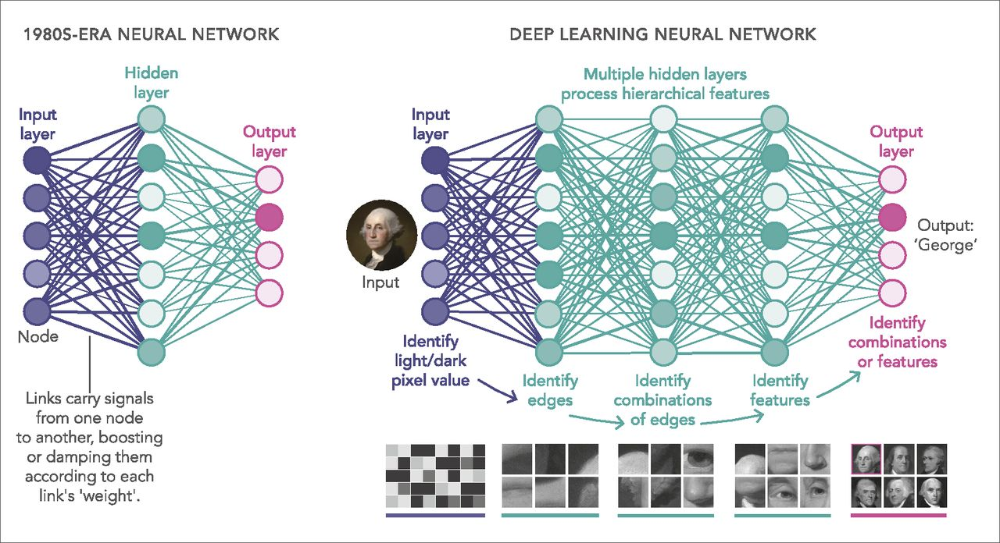

DEEP LEARNING

## **Overview**
This repo contains techniques and projects using various neural net and deep learning architectures.

## **Table Of Contents**
---

### **Techniques**
1. [Perceptron]()
2. [Full Connected Neural Network]()
3. [Convolution Neural Networks]()
4. [Reccurent Neural Networks]()
5. [Generative Adversarial Networks]()
6. [Deep Reinforcement Learning]()

### Projects
1. [Portfolio Optimizer](https://github.com/manchester9/portfolio-optimization)
