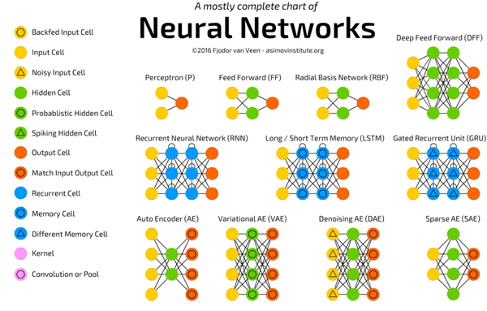

DEEP LEARNING

## **Overview**
This repo contains techniques, projects and courses using various neural net and deep learning architectures. More so for my learning experience and if the organization of content helps someone than even better.

# **Table Of Contents**

### **Techniques**
1. [Perceptron]()
2. [Multi Layer Perceptron]()
2. [Full Connected Neural Network]()
3. [Convolution Neural Networks]()
4. [Reccurent Neural Networks]()
5. [Generative Adversarial Networks]()
6. [Deep Reinforcement Learning]()

### **Projects**
1. [TBD]()

### **Courses**
1. [Deep Learning Specialization: Coursera]()
    * Neural Networks and Deep Learning 
    * Improving Deep Neural Networks: Hyperparameter tuning, Regularization and      Optimization
    * Structuring Machine Learning Projects
    * Convolutional Neural Networks
    * Sequence Models