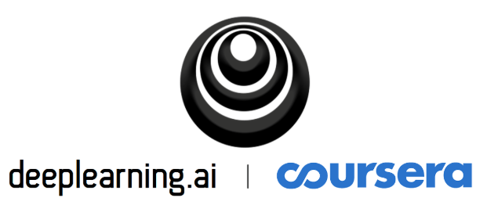

DEEP LEARNING.AI @ COURSERA

## **Overview**
This repo contains all the assignments, practice questions and programming questions of the deep learning specialization at Coursera. It was a great experience because of a decent blend of theoretical math and conceptual application of various deep learning algorithms. I highly recommend this specialization to anyone that is interested in getting familar with deep learning. 

# **Table Of Contents**

### **Assignments**
1. [TBD]()

### **Practice questions**
1. [TBD]()

### **Programming questions**
1. [TBD]
